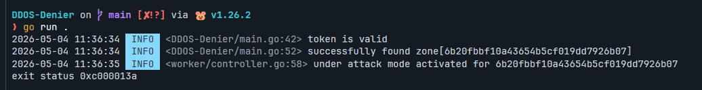

# DDOS-Denier

DDOS-Denier is a tool designed to evaluate incoming server attacks based on CPU load and automatically take countermeasures. Specifically tailored for Cloudflare websites, it seamlessly activates Cloudflare Under Attack Mode (UAM - DNS) during heavy CPU loads and deactivates it once the attack subsides.

## Configuration

See `.env` file

### Prerequisites

Before using DDOS-Denier, make sure to set up the necessary configurations.

#### Requires

- API key Permissions for: `All zones - Zone WAF:Edit, Zone WAF:Read, Zone Settings:Edit, Zone:Read, Zone:Edit`
